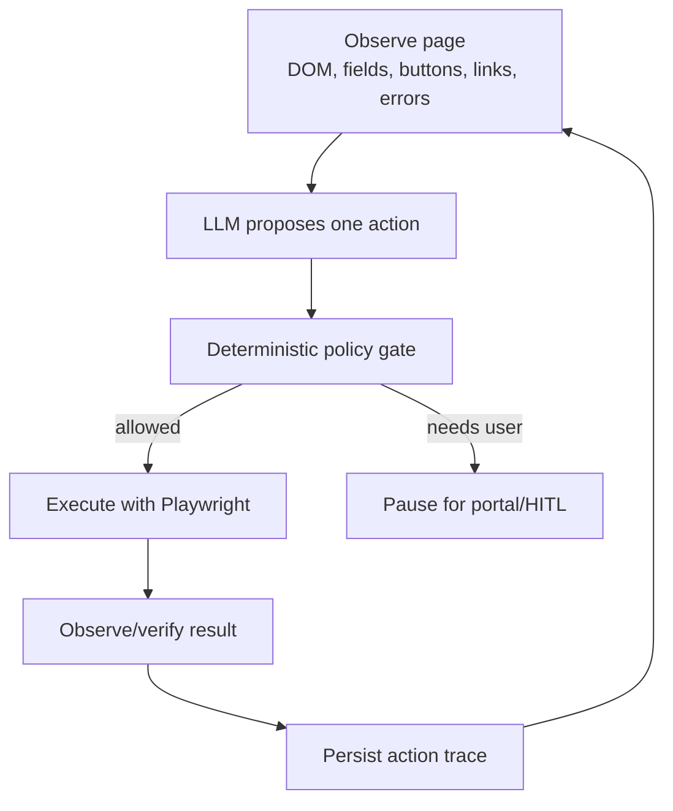

# Envoy External Apply Harness

This document tracks the custom harness for applying on external employer sites where fixed provider parsers are not enough.

## Pattern

Envoy uses a checkpointed observe-plan-act loop:

The LLM does not directly operate the browser. It proposes one structured action. Envoy validates and executes.

## Provider Routing Contract

Apply starts with a provider launch step, then branches by where the provider sends the browser:

- SEEK hosted apply: continue through the existing deterministic SEEK inspector, answer proposal, fill, and submit-gate flow.
- SEEK job that redirects to an employer/ATS portal: switch to the external apply harness.
- Providers without a hosted-apply parser yet, such as LinkedIn and Indeed: open the job URL and treat the page as an external harness entry point.
- Final submit remains human-gated for every provider and every external portal.

This keeps stable provider-native flows fast while using the generic harness only when fixed parsing is not reliable enough.

## Phase Plan

1. **Contracts and state models**
   - Define `PageObservation`, `ObservedField`, `ObservedAction`, `ProposedAction`, `ActionResult`, `ActionTrace`, `UserQuestion`, and `ExternalApplyState`.
   - Keep schemas strict enough to test and audit.

2. **Browser observation tool**
   - Add a provider-agnostic tools endpoint that turns the current browser page into `PageObservation`.
   - Include stable temporary `element_id` values for future action calls.
   - Extract fields, buttons, links, upload inputs, visible text, errors, and deterministic page type hints.

3. **Action tools**
   - Add narrow Playwright actions: fill text, select option, checkbox/radio, upload file, click.
   - Execute by `element_id`, not freeform selectors.

4. **Planner**
   - Call the LLM with page observation, profile facts, approved memory, recent action trace, and the allowed action schema.
   - Require exactly one proposed action.

5. **Policy gate**
   - Auto-allow low-risk profile-backed fields.
   - Pause for salary, work rights ambiguity, legal declarations, diversity questions, low confidence, and final submit.

6. **LangGraph integration**
   - Existing apply workflow calls one harness step at a time.
   - Persist every observation, proposed action, policy decision, and result.
   - Use portal/HITL interrupts for user input and final submit.

## Current Status

- Phase 1 is implemented in `agent/app/state/external_apply.py`.
- Phase 2 is started with `POST /tools/browser/observe_external_apply`.
- Agent-side typed wrapper is available as `observe_external_apply(...)` in `agent/app/tools/browser_client.py`.
- Phase 3 is started with `POST /tools/browser/execute_external_apply_action`.
- Action execution is still one action per call and only supports observed `element_id` targets.
- Phase 4A is started in `agent/app/services/external_apply_ai.py`.
- The planner builds a JSON-only prompt, parses one `ProposedAction`, rejects unknown `element_id`s, and falls back conservatively when the LLM is unavailable.
- Phase 4B is started in `agent/app/services/external_apply_harness.py`.
- The harness can now observe a page, call the planner, and return `ExternalApplyState` without executing the proposed action.
- Phase 5 is started in `agent/app/services/external_apply_policy.py`.
- The policy gate returns `allowed`, `paused`, or `rejected` before any proposed browser action can execute.
- Phase 6 is started with `run_external_apply_step(...)` in `agent/app/services/external_apply_harness.py`.
- One loop step now performs observe → plan → policy → execute-if-allowed and records an `ActionTrace`.
